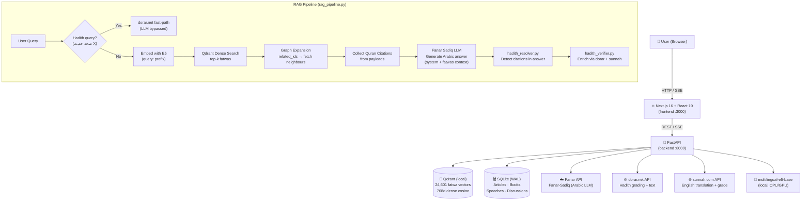

# مكتبة الشيخ ابن باز — Sheikh Ibn Baz Library

<div align="center">

**سماحة الشيخ عبد العزيز بن عبد الله بن باز رحمه الله**
*المفتي العام للمملكة العربية السعودية (١٣٣٠–١٤٢٠هـ)*

An Arabic RAG (Retrieval-Augmented Generation) application containing the complete digital legacy of **Sheikh Abdul Aziz ibn Abdullah ibn Baz** (1912–1999) — former Grand Mufti of Saudi Arabia. Includes 24,601 fatwas, 3,475 audio recordings, books, articles, speeches, discussions, and verified Quran grounding — all powered by a semantic search engine and an AI chatbot that answers questions **strictly based on the Sheikh's own fatwas**.

[](https://fastapi.tiangolo.com)
[](https://nextjs.org)
[](https://qdrant.tech)
[](https://fanar.qa)
[](LICENSE)

</div>

---

## 👤 Sheikh Abdul Aziz ibn Baz — Biography

<div align="center">
  
  <br/>
  <em>سماحة الشيخ عبد العزيز بن عبد الله بن باز رحمه الله (١٣٣٠–١٤٢٠هـ)</em>
</div>

### Early Life

Sheikh **Abdul Aziz ibn Abdullah ibn Abd al-Rahman ibn Baz** was born on **21 November 1912 CE (1330 AH)** in Riyadh, Saudi Arabia. His father passed away when he was just three years old. He began studying the Quran and Islamic sciences — hadith, fiqh, and tafsir — from a young age under the scholars of Riyadh, most notably under the man who would precede him as Grand Mufti, Sheikh Muhammad ibn Ibrahim Āl al-Sheikh.

In 1927 CE (1346 AH), at the age of sixteen, he began losing his eyesight following a severe eye infection. By the age of twenty (around 1932 CE / 1350 AH) he had lost his sight completely. Far from slowing him down, his blindness sharpened his memory and deepened his dedication to scholarship.

### Scholarship & Teaching

He studied under the great scholars of his era, most notably **Sheikh Muhammad ibn Ibrahim Āl al-Sheikh** (then Grand Mufti of Saudi Arabia), under whom he studied for over a decade. He mastered the traditional Islamic sciences: Quran, Hadith, Fiqh (Islamic jurisprudence), Aqeedah (creed), and Usul al-Fiqh (principles of jurisprudence).

He was appointed judge of Al-Kharj district in 1938 CE (upon recommendation of Sheikh Muhammad ibn ʿAbd al-Latif Āl al-Sheikh) and served in that role until 1951 CE. He then moved to teaching and academic work, and became known for his clarity, patience, and encyclopaedic memory. Students came from across the Arab world to sit in his circles of knowledge. Over his lifetime he wrote more than sixty books and treatises.

### Positions & Roles

| Year | Role |
|---|---|
| 1938 CE | Judge of Al-Kharj district (until 1951 CE) |
| 1961 CE | Faculty member, then Vice-President of the Islamic University of Madinah |
| 1970 CE | President of the Islamic University of Madinah |
| 1975 CE | Member of the Council of Senior Scholars (Hay'at Kibār al-ʿUlamāʾ) |
| 1976 CE | Head of the Permanent Committee for Islamic Research and Fatwas (اللجنة الدائمة للبحوث العلمية والإفتاء) |
| 1993 CE | **Grand Mufti of Saudi Arabia** and President of the Council of Senior Scholars — the highest religious office in the Kingdom |

### Character & Legacy

Sheikh Ibn Baz was renowned not only for his vast knowledge but for his **extraordinary humility and accessibility**. Despite holding the highest religious office in the land, he personally answered letters from ordinary Muslims around the world, often by hand. He would receive visitors — from heads of state to humble farmers — with equal warmth.

His fatwas spanned every domain of Islamic life: prayer, purification, family law, commerce, medicine, and international affairs. He was a firm defender of **Tawhid** (the oneness of Allah) and the Sunnah, and a staunch opponent of religious innovation (bid'ah).

He participated in and led numerous international Islamic bodies and conferences, and his voice carried weight across the entire Muslim world. Even foreign heads of state and scholars from different madhabs would write to him seeking guidance.

### Passing

Sheikh Ibn Baz passed away on **27 Muharram 1420 AH (13 May 1999 CE)** in Ta'if, Saudi Arabia, at the age of **86**, due to heart failure. He was buried in Al-Adl cemetery, Mecca. His funeral prayer was attended by hundreds of thousands of people. The Muslim world mourned him as the passing of an era.

> *"العلماء ورثة الأنبياء"*  
> *"The scholars are the inheritors of the Prophets"* — Hadith often cited in eulogies for the Sheikh.

His collected works, **مجموع فتاوى ابن باز** (*Majmu' Fatawa Ibn Baz*), run to **30 volumes** and remain a primary reference for Islamic rulings to this day. This application digitises and semantically indexes that legacy for the benefit of all.

---


| Feature | Description |
|---|---|
| 🔍 **Semantic Fatwa Search** | Search 24,601 fatwas using multilingual embeddings (`intfloat/multilingual-e5-base`, 768d) with optional category filtering |
| 🤖 **AI Chatbot** | Ask questions in Arabic and get structured answers grounded strictly in Ibn Baz's fatwas via **Fanar Sadiq** (Arabic-native LLM) — instructed never to generate content outside the retrieved fatwa context |
| 📜 **Hadith Verification** | Detects hadith citations in every AI answer and verifies them against **dorar.net** (grade + narrator + source), **sunnah.com** (English translation + cross-grade), and **islamweb.net** — displayed in colour-coded citation cards |
| ⚡ **Hadith Fast-Path** | Queries like «صحة حديث X» bypass the LLM entirely — dorar.net is queried directly and the verified grade (صحيح / حسن / ضعيف / موضوع) is returned with zero hallucination risk |
| 🎤 **Voice Input** | Microphone button in the chat interface uses the browser Web Speech API for Arabic dictation |
| 📖 **Quran Grounding** | Every AI answer cites verified Quranic verses (6,236 verses) with surah/ayah references |
| 🕸️ **Graph-Enhanced RAG** | 73,803 fatwa-to-fatwa citation edges used for graph expansion during retrieval — relevant related fatwas are surfaced automatically |
| 🎧 **Audio Player** | 80.5% of fatwas have original audio recordings; built-in HTML5 player on each fatwa detail page |
| 📚 **Full Library** | Books (286 PDFs), Articles (169), Speeches (298), Discussions (133), Audio recordings (3,475) |
| 🗂️ **Category Filtering** | Browse fatwas across 221 unique Islamic topic categories |
| ↗️ **SSE Streaming** | Real-time answer streaming via Server-Sent Events with automatic non-streaming fallback |
| ✍️ **Markdown Rendering** | AI responses render bold, lists, and headings via ReactMarkdown + remark-gfm |
| 🧩 **Nested Q&A** | Fatwas with follow-up س/ج pairs are parsed and displayed as structured nested dialogs |
| 🌙 **Arabic-First UI** | Full RTL layout, dark mode, Amiri font with full Arabic honorific fallback stack (ﷺ renders correctly on all OSes), mobile-responsive |

---

## 🏗️ Architecture



---

## ⚙️ Tech Stack

| Layer | Technology | Version | Purpose |
|---|---|---|---|
| **Embedding** | `intfloat/multilingual-e5-base` | — | Query & fatwa encoding (768-dim dense vectors) |
| **Vector DB** | Qdrant (local file mode) | ≥1.12 | Dense semantic search + graph traversal via `related_ids` |
| **LLM** | Fanar `Fanar-Sadiq` (Arabic-native) | — | Arabic answer generation via OpenAI-compatible Fanar API |
| **Hadith APIs** | dorar.net · sunnah.com · islamweb.net | — | Multi-provider hadith grading and enrichment |
| **Backend** | FastAPI + uvicorn | ≥0.115 | REST API with GZip + CORS middleware |
| **Content DB** | SQLite (WAL mode) | built-in | Articles, books, speeches, discussions |
| **HTTP client** | httpx, aiohttp | ≥0.27 | Async HTTP for Fanar API + hadith providers |
| **Scraper** | Scrapling + requests | — | Anti-bot-safe HTML scraping of binbaz.org.sa |
| **Frontend** | Next.js 16 + React 19 | 16.1.6 | RTL Arabic UI with SSE streaming |
| **UI Components** | shadcn/ui + Radix UI | — | Cards, badges, sheets, scroll areas |
| **Styling** | Tailwind CSS 4 | ^4 | Dark mode, RTL, Arabic typography |
| **Fonts** | Amiri + Noto Kufi Arabic | — | Google Fonts, loaded via `next/font` |

---

## 🗂️ Project Structure

```
ibn-baz/
├── backend/
│   ├── api/
│   │   ├── main.py              # FastAPI app: CORS, GZip, route registration, /health
│   │   ├── models.py            # Pydantic schemas (FatwaBrief, FatwaFull, ChatRequest, ChatResponse…)
│   │   ├── retriever.py         # Qdrant: embed_query, search_fatwas, scroll_fatwas, get_related_fatwas
│   │   ├── generator.py         # Fanar API: prompt builder + generate() → RAGResponse
│   │   ├── hadith_verifier.py   # Multi-provider hadith grading: dorar.net → sunnah.com → islamweb.net
│   │   ├── hadith_resolver.py   # Extracts hadith citations from LLM answer text (5 extraction strategies)
│   │   ├── audio.py             # /api/audio/transcribe — Arabic speech-to-text via Fanar Whisper
│   │   ├── rag_pipeline.py      # Orchestrates: retrieve → graph expand → Quran citations → generate
│   │   └── routes/
│   │       ├── fatwas.py        # GET /api/fatwas  /api/fatwas/{id}  /api/fatwas/{id}/related  /api/fatwas/categories
│   │       ├── content.py       # GET /api/articles  /api/books  /api/speeches  /api/discussions  (+ /{id})
│   │       ├── chat.py          # POST /api/chat  POST /api/chat/stream (SSE)
│   │       ├── audio.py         # POST /api/audio/transcribe (Arabic voice input)
│   │       └── stats.py         # GET /api/stats
│   ├── scripts/
│   │   ├── 01_download_quran.py   # Fetches 6,236 Quran verses from AlQuran Cloud → data/quran_verses.json
│   │   ├── 02_enrich_fatwas.py    # Parses Quran citations in fatwa text → data/enriched_fatwas.jsonl
│   │   ├── 03_build_index.py      # Embeds 24,601 fatwas into Qdrant (batch=64, ~70 min on CPU)
│   │   └── 04_load_content.py     # Inserts articles/books/speeches/discussions into SQLite
│   ├── data/
│   │   ├── fatwa.jsonl            # 24,601 scraped fatwas (raw)
│   │   ├── enriched_fatwas.jsonl  # 24,601 fatwas + quran_citations field
│   │   ├── quran_verses.json      # 6,236 verified Arabic verses (114 surahs)
│   │   ├── article.jsonl          # 169 articles
│   │   ├── book.jsonl             # 286 books (PDF links only, translated editions excluded)
│   │   ├── speech.jsonl           # 298 speeches
│   │   ├── discussion.jsonl       # 133 discussions
│   │   └── audio.jsonl            # 3,475 audio recordings
│   ├── qdrant_data/               # Local Qdrant vector store (binary, git-ignored)
│   ├── content.db                 # SQLite database (git-ignored)
│   ├── config.py                  # Pydantic settings: loads .env, provides typed `settings` singleton
│   ├── .env                       # API keys and paths (see Configuration)
│   └── requirements.txt
├── scraper/
│   ├── run.py                     # Full production scraper: 6 content types, multi-threaded, resumable
│   ├── test_pipeline.py           # Per-page test scraper + PDF OCR experiments
│   ├── discovery.js               # JS-based URL discovery helper
│   └── output/                    # Scraper output .jsonl files + analysis charts
├── frontend/
│   ├── src/
│   │   ├── app/
│   │   │   ├── layout.tsx         # Root layout: RTL, dark, Amiri + Noto Kufi fonts, Header + Footer
│   │   │   ├── page.tsx           # Home: hero search, stats cards, Sheikh biography, quick links
│   │   │   ├── fatwas/
│   │   │   │   ├── page.tsx       # Fatwa list: search, pagination, category badges, audio indicator
│   │   │   │   └── [id]/page.tsx  # Fatwa detail: question, answer, nested Q&A, audio player, sidebar
│   │   │   ├── audios/            # Audio recordings list
│   │   │   ├── articles/          # Articles list + [id] detail
│   │   │   ├── books/             # Books list (PDF links)
│   │   │   ├── speeches/          # Speeches list + [id] detail
│   │   │   ├── discussions/       # Discussions list + [id] detail
│   │   │   └── chat/page.tsx      # AI chatbot: SSE streaming, suggested questions, citations display
│   │   ├── components/
│   │   │   ├── layout/
│   │   │   │   ├── Header.tsx     # Sticky header: logo, desktop nav, mobile Sheet drawer
│   │   │   │   └── Footer.tsx
│   │   │   ├── content/
│   │   │   │   ├── NestedQA.tsx   # Renders nested س/ج Q&A pairs inside fatwa answers
│   │   │   │   ├── QuranBlock.tsx # Displays verified Quran verses with quran.com links
│   │   │   │   └── HadithBlock.tsx# Colour-coded hadith citation cards (grade badge + 3 source links)
│   │   ├── hooks/
│   │   │   └── useVoiceInput.ts   # Web Speech API hook — Arabic dictation for chat input
│   │   │   └── ui/                # shadcn/ui components (Card, Badge, Button, Input, etc.)
│   │   ├── lib/
│   │   │   ├── api.ts             # Typed API client: fatwas, articles, books, speeches, discussions, chat, stats
│   │   │   └── utils.ts
│   │   └── types/index.ts         # TypeScript interfaces mirroring Pydantic models
│   └── public/ibn-baz.png         # Sheikh's portrait (used in header + home page)
├── start.ps1                      # Windows startup: kills ports 8000/3000, opens both services
└── README.md
```

---

## 📦 Data Pipeline

The pipeline runs **once** to transform raw scraped data into a live search index.

```
binbaz.org.sa
      │
      ▼ scraper/run.py  (multi-threaded, resumable)
      │
      ├─ data/fatwa.jsonl         (24,601 records)
      ├─ data/audio.jsonl         (3,475 records)
      ├─ data/article.jsonl       (169 records)
      ├─ data/book.jsonl          (286 records)
      ├─ data/speech.jsonl        (298 records)
      └─ data/discussion.jsonl    (133 records)
            │
            ▼ 01_download_quran.py  (~30 s)
            │
            ├─ data/quran_verses.json    (6,236 verses, AlQuran Cloud API)
            │
            ▼ 02_enrich_fatwas.py  (~5 min)
            │
            ├─ data/enriched_fatwas.jsonl  (adds quran_citations[] to every fatwa)
            │
            ▼ 03_build_index.py  (~70 min CPU / ~15 min GPU)
            │
            ├─ qdrant_data/   (768-dim dense vectors, cosine similarity)
            │
            ▼ 04_load_content.py  (~1 min)
            │
            └─ content.db  (SQLite WAL: articles, books, speeches, discussions)
```

### Scraper details (`scraper/run.py`)

- **Resumable**: tracks already-scraped URLs via existing `.jsonl` files on startup; safe to re-run
- **Multi-threaded**: default 3 workers, configurable with `--workers N`
- **Polite delay**: 0.5 s between requests by default (`--delay SECONDS`)
- **Content types**: `fatwa`, `audio`, `book`, `article`, `speech`, `discussion`
- Translated books (French, English, Chinese, etc.) are automatically skipped
- Errors are logged to `output/errors.jsonl` and do not stop the run

### Fatwa data schema

Each fatwa record in `fatwa.jsonl` / `enriched_fatwas.jsonl` has:

| Field | Type | Description |
|---|---|---|
| `fatwa_id` | int | Numeric ID extracted from URL (Qdrant point ID) |
| `url` | str | Original URL on binbaz.org.sa |
| `title` | str | Fatwa title (from `<h1>`) |
| `question` | str | Extracted question text (strips السؤال/س prefix) |
| `answer_direct` | str | Direct answer (before any nested س/ج follow-ups) |
| `nested_qa` | list | Nested follow-up Q&A pairs `[{q, a}]` extracted from answer body |
| `answer` | str | Full answer body (stripped of source refs) |
| `source_ref` | str | Publication reference (e.g. "مجموع فتاوى ابن باز (1/54)") |
| `text` | str | `question + answer` — the field used for embedding |
| `categories` | list[str] | Islamic topic categories |
| `related` | list[{url, title}] | Raw related fatwa links from the page |
| `related_ids` | list[int] | Numeric IDs of related fatwas (graph edges) |
| `audio_url` | str | Direct `.mp3` URL if audio exists |
| `quran_citations` | list[dict] | Verified Quran citations `{reference, surah_number, ayah_number, surah_name, verified_text, quran_url}` |
| `scraped_at` | str | ISO timestamp |

---

## 🚀 Quick Start

### Prerequisites

- Python 3.11+
- Node.js 20+
- 4 GB RAM minimum (embedding model loads into memory)
- A [Fanar API key](https://fanar.qa) — Arabic-native LLM powering the chatbot
- *(Optional)* A [sunnah.com API key](https://sunnah.com/developers) — enables English hadith translations

### 1 — Clone & configure

```bash
git clone https://github.com/AbdelrahmanAboegela/Ibn-Baz.git
cd Ibn-Baz
```

Copy and fill the backend environment file:

```bash
cp backend/.env.example backend/.env
```

```env
# backend/.env
FANAR_API_KEY=...              # Required — Fanar Arabic LLM (https://fanar.qa)

SUNNAH_API_KEY=...             # Optional — enables English hadith translations from sunnah.com

EMBEDDING_MODEL=intfloat/multilingual-e5-base
QDRANT_COLLECTION=fatwas

# Paths (defaults work out of the box)
# QDRANT_PATH=./qdrant_data
# CONTENT_DB_PATH=./content.db
# DATA_DIR=./data
```

### 2 — Install backend

```bash
cd backend
pip install -r requirements.txt
```

### 3 — Run the data pipeline (one-time)

```bash
# Must be run from the backend/ directory
python scripts/01_download_quran.py      # ~30 s    — 6,236 Quran verses
python scripts/02_enrich_fatwas.py       # ~5 min   — parse Quran citations
python scripts/03_build_index.py         # ~70 min  — embed 24,601 fatwas into Qdrant
python scripts/04_load_content.py        # ~1 min   — load other content into SQLite
```

> **Note:** Step 3 looks for `data/enriched_fatwas.jsonl` first, then falls back to `data/fatwa.jsonl`. If neither exists, run the scraper first:
> ```bash
> cd ../scraper
> pip install scrapling requests
> python run.py --types fatwa
> ```

### 4 — Install frontend

```bash
cd ../frontend
npm install
```

### 5 — Start everything

From the project root on Windows:

```powershell
.\start.ps1
```

This kills any processes already on ports 8000/3000 and opens both services in separate terminal windows.

| Service | URL |
|---|---|
| Frontend | http://localhost:3000 |
| Backend API | http://localhost:8000 |
| API Docs (Swagger) | http://localhost:8000/docs |

To start manually on any OS:

```bash
# Terminal 1 — backend
cd backend
uvicorn api.main:app --reload --host 0.0.0.0 --port 8000

# Terminal 2 — frontend
cd frontend
npm run dev
```

---

## 🔌 API Reference

All endpoints return JSON. Base URL: `http://localhost:8000`

### Stats

```http
GET /api/stats
```
Returns `DashboardStats`: total fatwas, articles, books, speeches, discussions, categories.

---

### Fatwas

```http
GET /api/fatwas?page=1&per_page=20&category=الصلاة&search=وضوء
```
- `search` triggers vector search; otherwise paginates via Qdrant scroll
- Returns `PaginatedResponse<FatwaBrief>`

```http
GET /api/fatwas/categories
```
Returns `string[]` of all distinct category values.

```http
GET /api/fatwas/{fatwa_id}
```
Returns full `FatwaFull` with `quran_citations`, `related_ids`, `audio_url`.

```http
GET /api/fatwas/{fatwa_id}/related
```
Returns `RelatedFatwa[]` — fetched from Qdrant by `related_ids` (graph expansion).

---

### Content

```http
GET /api/articles?page=1&per_page=20&category=...
GET /api/articles/{id}

GET /api/books               # returns all 296 books
GET /api/books/{id}

GET /api/speeches?page=1&per_page=20
GET /api/speeches/{id}

GET /api/discussions?page=1&per_page=20
GET /api/discussions/{id}
```

All list endpoints return `PaginatedResponse`. Content is served from SQLite.

---

### Chat (RAG)

```http
POST /api/chat
Content-Type: application/json

{ "query": "ما حكم التميمة من القرآن؟", "top_k": 5 }
```

Returns `ChatResponse`:

| Field | Type | Description |
|---|---|---|
| `answer` | string | Full Arabic answer from Fanar Sadiq |
| `confidence` | float | Top retrieval score (0–1) |
| `cited_fatwas` | CitedFatwa[] | Fatwa IDs, titles, source refs, relevance scores |
| `quran_citations` | QuranCitation[] | Verified verses from retrieved fatwas |
| `hadith_citations` | HadithCitation[] | Verified hadith results from dorar.net + sunnah.com enrichment |
| `related_fatwas` | RelatedFatwa[] | Graph-expanded neighbour fatwas |
| `query_time_ms` | float | Total pipeline latency |

```http
POST /api/chat/stream
Content-Type: application/json

{ "query": "...", "top_k": 5 }
```

Returns `text/event-stream` with SSE events:

| Event type | Payload |
|---|---|
| `status` | `"جاري البحث..."` — pipeline started |
| `chunk` | Streamed answer text (50 chars at a time) |
| `metadata` | Full `ChatResponse` JSON after streaming finishes |
| `done` | Empty — stream ended |
| `error` | Error message string |

---

### Audio Transcription (Voice Input)

```http
POST /api/audio/transcribe
Content-Type: multipart/form-data

file=<audio_blob>
```

Returns `{ "text": "..." }` — Arabic transcript of the uploaded audio. Used by the chat UI's microphone button to convert recorded speech to text before sending to `/api/chat`.

---

## 🕸️ Graph-Enhanced RAG

Every fatwa stores a `related_ids` list — numeric IDs of fatwas that the site links to from that page. This creates a **citation graph** of 73,803 directed edges across 24,601 nodes.

During retrieval, the pipeline:

1. Retrieves top-k fatwas by dense vector similarity
2. Collects all `related_ids` from the retrieved set
3. Fetches those neighbour fatwas from Qdrant (up to 10 new ones, excluding already-retrieved)
4. Passes their titles as extra context to the LLM

This gives the LLM awareness of semantically adjacent fatwas it might not have retrieved directly, improving answer completeness for complex questions.

**Graph statistics:**

| Metric | Value |
|---|---|
| Total nodes (fatwas) | 24,601 |
| Total edges | 73,803 |
| Average in-degree | 3.0 |
| Max in-degree | 571 (حكم كشف المرأة لوجهها) |
| Fatwas with no incoming citations | 79.7% |

The graph follows a power-law degree distribution (scale-free) — a small number of hub fatwas are cited hundreds of times and act as natural anchor nodes for retrieval.

---

## 📜 Hadith Verification

When a user asks about a hadith (e.g. «صحة حديث X» or «هل صح الحديث ...»), the pipeline takes two different paths depending on context:

### Fast-path (direct hadith authenticity queries)

If the query matches the pattern of a direct hadith authenticity question, the LLM is **bypassed entirely**:

1. The hadith text is extracted from the query
2. **dorar.net** is queried directly via its search API
3. The grade (صحيح / حسن / ضعيف / موضوع), narrator chain, and source are returned
4. The response is generated deterministically — no hallucination risk

### Normal-path (hadith cited inside a fatwa answer)

For all other queries the normal RAG pipeline runs, but after the LLM generates its answer:

1. **`hadith_resolver.py`** scans the answer text using 5 extraction strategies (prophetic-speech markers, trigger verbs, direct collection references, parenthetical quotes, standalone متفق عليه)
2. **`hadith_verifier.py`** sends each extracted snippet to **dorar.net** → **sunnah.com** → **islamweb.net** in parallel via `asyncio.gather`
3. Results are deduplicated and enriched with grade badge colour, narrator, source collection, English translation (when sunnah.com key available), and external links

### HadithBlock UI

Each verified hadith is displayed in a colour-coded card in the frontend:

| Grade | Badge colour |
|---|---|
| صحيح | 🟢 Green |
| حسن | 🔵 Blue |
| ضعيف | 🟡 Yellow |
| موضوع / منكر | 🔴 Red |

Each card links to:
- **dorar.net** — Arabic full chain + ruling (always shown)
- **sunnah.com** — English translation with book:hadith number (shown only when a sequence number is known)
- **islamweb.net** — Arabic hadith fatwa search

### dorar.net search URL format

```
https://dorar.net/hadith/search?searchType=word&st=w&test=1&q={encoded_hadith_text}
```

> ⚠️ The older `/hadith?q=` endpoint is incorrect and redirects to the homepage. Always use `/hadith/search` with `searchType=word&st=w&test=1`.

---

## 🎤 Voice Input

The chat interface includes a microphone button that uses the **Web Speech API** (`webkitSpeechRecognition`) for Arabic dictation:

- Language is set to `ar-SA` (Saudi Arabic)
- Recognised text is appended to the current chat input field
- Works in Chrome/Edge; Safari and Firefox require fallback (button hidden automatically if API is unavailable)
- Implemented in `frontend/src/hooks/useVoiceInput.ts`

---


### Backend (`backend/.env`)

| Variable | Default | Description |
|---|---|---|
| `FANAR_API_KEY` | — | **Required.** Fanar Arabic LLM API key |
| `SUNNAH_API_KEY` | — | Optional — sunnah.com key for English hadith translations |
| `EMBEDDING_MODEL` | `intfloat/multilingual-e5-base` | HuggingFace sentence-transformer model |
| `HF_HOME` | `~/.cache/huggingface` | HuggingFace model cache directory |
| `QDRANT_PATH` | `./qdrant_data` | Local Qdrant storage directory |
| `QDRANT_COLLECTION` | `fatwas` | Qdrant collection name |
| `CONTENT_DB_PATH` | `./content.db` | SQLite database path |
| `DATA_DIR` | `./data` | Directory containing `.jsonl` data files |
| `API_HOST` | `0.0.0.0` | uvicorn bind host |
| `API_PORT` | `8000` | uvicorn bind port |

### Frontend (`frontend/.env.local`)

| Variable | Default | Description |
|---|---|---|
| `NEXT_PUBLIC_API_URL` | `http://localhost:8000` | Backend base URL |

---

## 📊 Data Statistics

| Content Type | Count | Notes |
|---|---|---|
| Fatwas | 24,601 | Indexed in Qdrant; 80.5% have audio |
| Audio recordings | 3,475 | 313 audio-only (no transcript on site) |
| Books | 286 | PDF links; translated editions excluded |
| Articles | 169 | — |
| Speeches | 298 | — |
| Discussions | 133 | — |
| Quran verses | 6,236 | All 114 surahs, AlQuran Cloud API |
| Unique categories | 221 | Average 1.2 categories per fatwa |
| Graph edges | 73,803 | Fatwa citation network |
| Fatwas with Quran citations | ~34% | Parsed with regex from answer text |

---

## 🤝 Contributing

This is a research/educational project. Contributions that improve Arabic NLP quality, add Hadith grounding, improve graph traversal, or enhance the UI are welcome. Open an issue first for significant changes.

---

## 📄 License

MIT — see [LICENSE](LICENSE) for details.

> **Educational use only.** This application is not a substitute for consulting qualified Islamic scholars. Always refer questions of Islamic ruling to a competent and trusted scholar.

