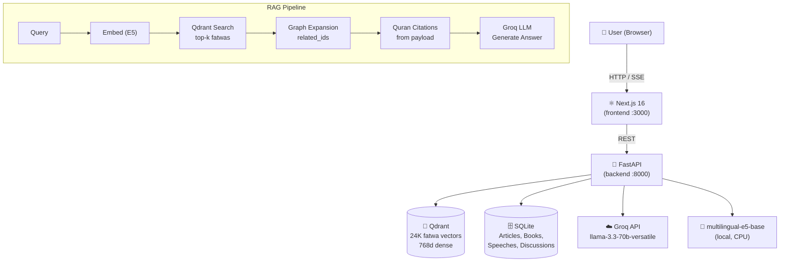

# مكتبة الشيخ ابن باز — Sheikh Ibn Baz Library

<div align="center">

An Arabic RAG (Retrieval-Augmented Generation) application containing the full digital legacy of **Sheikh Abdul Aziz ibn Abdullah ibn Baz** (1909–1999) — former Grand Mufti of Saudi Arabia. Includes 24,000+ fatwas, books, articles, speeches, and Quran grounding, powered by a semantic search engine and an AI chatbot that answers questions in the voice of the Sheikh.

[](https://fastapi.tiangolo.com)
[](https://nextjs.org)
[](https://qdrant.tech)
[](LICENSE)

</div>

---

## ✨ Features

| Feature | Description |
|---|---|
| 🔍 **Semantic Fatwa Search** | Search 24,601 fatwas using multilingual embeddings (E5-base) |
| 🤖 **AI Chatbot** | Ask questions and get answers grounded in Ibn Baz's fatwas via Groq LLaMA 70B |
| 📖 **Quran Grounding** | Every AI answer cites verified Quranic verses with links to quran.com |
| 🎧 **Audio Player** | Listen to fatwas that have an original audio recording |
| 📚 **Full Library** | Books (286), Articles (169), Speeches (298), Discussions (133) |
| 🗂️ **Category Filtering** | Browse fatwas by Islamic topic category |
| ↗️ **SSE Streaming** | Real-time answer streaming via Server-Sent Events |
| 🌙 **Arabic-First UI** | Full RTL layout, Amiri font, dark mode |

---

## 🏗️ Architecture



---

## 🗂️ Project Structure

```
ibn-baz/
├── backend/
│   ├── api/
│   │   ├── main.py             # FastAPI assembly, CORS, GZip
│   │   ├── generator.py        # Groq API generation
│   │   ├── retriever.py        # Qdrant semantic search
│   │   ├── rag_pipeline.py     # Full RAG orchestration
│   │   ├── models.py           # Pydantic schemas
│   │   └── routes/
│   │       ├── fatwas.py       # GET /api/fatwas, /api/fatwas/{id}
│   │       ├── content.py      # Articles, Books, Speeches, Discussions
│   │       ├── chat.py         # POST /api/chat, /api/chat/stream (SSE)
│   │       └── stats.py        # GET /api/stats
│   ├── scripts/
│   │   ├── 01_download_quran.py   # Downloads 6,236 Quran verses
│   │   ├── 02_enrich_fatwas.py    # Parses Quran citations from fatwas
│   │   ├── 03_build_index.py      # Embeds 24K fatwas → Qdrant
│   │   └── 04_load_content.py     # Loads articles/books/speeches → SQLite
│   ├── scraper/                # Web scraper (binbaz.org.sa)
│   ├── data/
│   │   ├── fatwas_enriched.jsonl  # 24,601 enriched fatwas
│   │   ├── quran_verses.json      # 6,236 verified Quran verses
│   │   └── *.jsonl                # articles, books, speeches, discussions
│   ├── qdrant_data/           # Local Qdrant vector store
│   ├── content.db             # SQLite for non-fatwa content
│   ├── config.py              # Pydantic settings + env loading
│   └── requirements.txt
├── frontend/
│   ├── src/
│   │   ├── app/
│   │   │   ├── page.tsx           # Home: hero, stats, biography
│   │   │   ├── fatwas/            # List + detail pages
│   │   │   ├── articles/          # List + [id] detail
│   │   │   ├── books/             # List + [id] detail
│   │   │   ├── speeches/          # List + [id] detail
│   │   │   ├── discussions/       # List + [id] detail
│   │   │   └── chat/              # AI chatbot with SSE streaming
│   │   ├── components/
│   │   │   ├── layout/Header.tsx
│   │   │   └── ui/                # shadcn/ui components
│   │   └── lib/api.ts             # Typed API client
│   └── public/ibn-baz.png
├── start.ps1                  # Unified startup script (Windows)
└── README.md
```

---

## 🚀 Quick Start

### Prerequisites

- Python 3.11+
- Node.js 20+
- 4 GB RAM (embedding model loads into memory)
- A [Groq API key](https://console.groq.com) (free tier works)

### 1 — Clone & configure

```bash
git clone https://github.com/AbdelrahmanAboegela/Ibn-Baz.git
cd Ibn-Baz/backend
```

Copy `.env.example` to `.env` and fill in your Groq key:

```env
GROQ_API_KEY=gsk_...
GROQ_MODEL=llama-3.3-70b-versatile
```

### 2 — Install backend

```bash
pip install -r requirements.txt
```

### 3 — Run data pipeline (one-time)

```bash
python scripts/01_download_quran.py      # ~30s  — downloads 6,236 Quran verses
python scripts/02_enrich_fatwas.py       # ~5 min — parses Quran citations
python scripts/03_build_index.py         # ~70 min — embeds 24K fatwas into Qdrant
python scripts/04_load_content.py        # ~1 min — loads other content into SQLite
```

> **Note:** Step 3 requires the scraper output (`data/fatwas_enriched.jsonl`). If it doesn't exist, run the scraper first with `python scraper/run.py --types fatwa`.

### 4 — Install frontend

```bash
cd ../frontend
npm install
```

### 5 — Start everything

From the project root (`ibn-baz/`):

```powershell
.\start.ps1
```

This kills any old processes on ports 8000/3000 and opens both services in separate terminal windows.

| Service | URL |
|---|---|
| Frontend | http://localhost:3000 |
| Backend API | http://localhost:8000 |
| API Docs | http://localhost:8000/docs |

---

## 🔌 API Reference

### Chat (RAG)

```http
POST /api/chat
Content-Type: application/json

{ "query": "ما حكم التميمة من القرآن؟", "top_k": 5 }
```

| Field | Type | Description |
|---|---|---|
| `answer` | string | Full Arabic answer from LLaMA 70B |
| `confidence` | float | Retrieval confidence score (0–1) |
| `cited_fatwas` | array | Fatwa IDs, titles, source refs cited |
| `quran_citations` | array | Verified Quran verses from retrieved fatwas |
| `query_time_ms` | float | Total pipeline latency |

### SSE Streaming

```http
POST /api/chat/stream
```

Streams Server-Sent Events with types: `status`, `chunk`, `metadata`, `done`, `error`.

### Fatwas

```http
GET /api/fatwas?page=1&per_page=20&category=الصلاة&search=وضوء
GET /api/fatwas/{id}
GET /api/fatwas/{id}/related
GET /api/fatwas/categories
```

### Content

```http
GET /api/articles?page=1&per_page=15
GET /api/articles/{id}
GET /api/books
GET /api/books/{id}
GET /api/speeches?page=1&per_page=15
GET /api/speeches/{id}
GET /api/discussions?page=1&per_page=15
GET /api/discussions/{id}
```

### Stats

```http
GET /api/stats
# Returns totals: fatwas, articles, books, speeches, discussions, categories
```

---

## ⚙️ Tech Stack

| Layer | Technology | Purpose |
|---|---|---|
| **Embedding** | `intfloat/multilingual-e5-base` | Query & fatwa encoding (768-dim) |
| **Vector DB** | Qdrant (local) | Dense semantic search over 24K fatwas |
| **LLM** | Groq `llama-3.3-70b-versatile` | Arabic answer generation |
| **Backend** | FastAPI + GZip + CORS | REST API with streaming |
| **Content DB** | SQLite (WAL mode) | Books, articles, speeches, discussions |
| **Frontend** | Next.js 16 + shadcn/ui | RTL Arabic UI |
| **Styling** | Tailwind CSS | Dark mode, Arabic typography |

---

## 🔧 Configuration (`.env`)

| Variable | Default | Description |
|---|---|---|
| `GROQ_API_KEY` | — | **Required.** Groq API key |
| `GROQ_MODEL` | `llama-3.3-70b-versatile` | LLM model name |
| `HF_HOME` | system default | HuggingFace cache path |
| `EMBEDDING_MODEL` | `intfloat/multilingual-e5-base` | Sentence transformer model |
| `QDRANT_COLLECTION` | `ibn_baz_fatwas` | Qdrant collection name |

---

## 📊 Data Statistics

| Content Type | Count |
|---|---|
| Fatwas (indexed in Qdrant) | 24,601 |
| Quran verses | 6,236 |
| Books | 286 |
| Articles | 169 |
| Speeches | 298 |
| Discussions | 133 |

---

## 🤝 Contributing

This is a research/educational project. Contributions that improve Arabic NLP quality, add Hadith grounding, or improve the UI are welcome.

---

## 📄 License

MIT — see [LICENSE](LICENSE) for details.

> **Educational use only.** This application is not a substitute for consulting qualified Islamic scholars.
